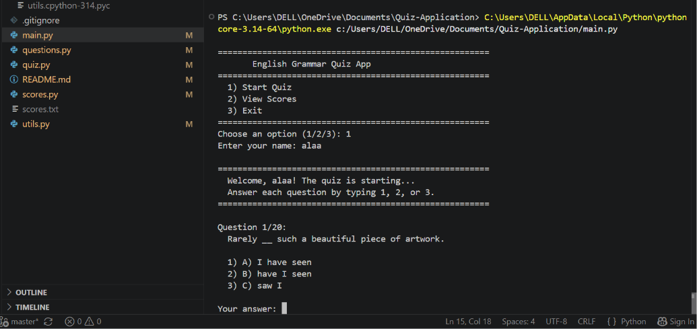
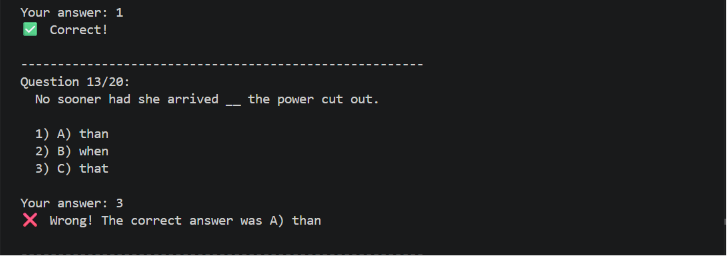
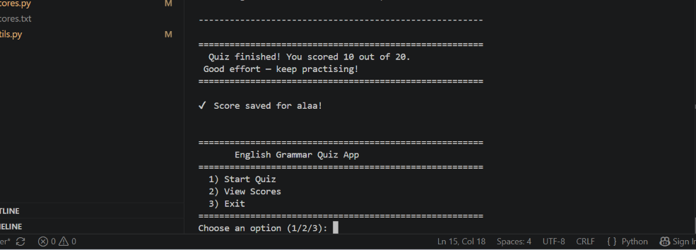

# English Grammar Quiz App

A Python console quiz app that tests English grammar skills with 20 questions — randomized every game, with score saving and full input validation.

Built from scratch over 3 days as part of my Python learning journey, right after completing my Python certification.

---

## Screenshots

**Running the quiz**



**Answer feedback**



**Final score screen**



---

## Features

- 20 English grammar questions covering tenses, conditionals, passive voice, inversion, and more
- Questions are randomized every time you play
- Input validation — no crashes from empty or invalid answers
- Scores saved automatically to `scores.txt` with name, result, and timestamp
- View all past scores from the main menu
- Performance feedback based on your result
- Graceful exit on Ctrl+C

---

## Project Structure

```
Quiz-Application/
│
├── main.py          # Entry point — runs the app
├── quiz.py          # Quiz logic and question flow
├── questions.py     # All 20 grammar questions and answers
├── scores.py        # Save and display player scores
├── utils.py         # Input validation helper
└── scores.txt       # Auto-generated when you play
```

---

## How to Run

Make sure you have Python 3 installed, then run:

```bash
python main.py
```

No external libraries needed — uses Python's standard library only.

---

## How to Play

1. Choose **Start Quiz** from the menu
2. Enter your name
3. Answer each question by typing **1**, **2**, or **3**
4. See instant feedback after each answer
5. Get your final score and performance message at the end
6. Your result is saved automatically to `scores.txt`

---

## Scoring

| Score | Feedback |
|-------|----------|
| 20/20 | Perfect score! Outstanding! |
| 16–19 | Great job! |
| 10–15 | Good effort — keep practising! |
| 0–9   | Keep studying — you'll get there! |

---

## Topics Covered

- Present simple & past perfect tenses
- Conditional sentences (types 1, 2, 3)
- Subjunctive mood
- Passive voice
- Question tags
- Prepositions of time
- Inversion with negative adverbs
- Gerunds vs infinitives
- Subject-verb agreement
- Correlative conjunctions

---

## What I Learned Building This

- Splitting a project across multiple files with clean imports
- Using `random.shuffle()` to randomize question order
- Writing reusable input validation with `while True` loops
- Appending data to files and reading them back
- Handling edge cases like empty input, invalid answers, and Ctrl+C exits
- Committing progress step by step using Git

---

## Author

**Alaa Kawther** — Second Year Computer Science Student

Built over 3 days, step by step.

All commits tracked on GitHub to show the full build process.
